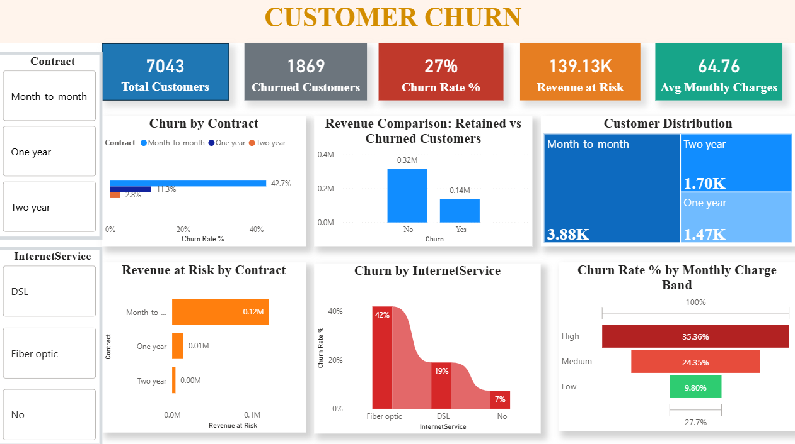

# 📌 Customer Churn Analysis | Python • SQL • Power BI

## 🔍 Project Overview
Customer churn is a critical business problem where customers stop using a company’s services, directly impacting revenue and growth.

This project implements an **end-to-end customer churn analysis pipeline** using:
- **Python** for data cleaning, EDA, feature engineering, and machine learning
- **SQL** for structured analysis, KPIs, and aggregations
- **Power BI** for interactive dashboards and business insights

The goal is to simulate a **real-world analytics workflow** from raw data to executive-ready dashboards.

---

## 🎯 Business Objectives
- Identify customer churn patterns  
- Understand key drivers of customer attrition  
- Predict churn probability using machine learning  
- Enable data-driven retention strategies  

---

## 🗂️ Data Source
- **Dataset:** Telco Customer Churn  
- **Platform:** Kaggle  
- **Link:** https://www.kaggle.com/datasets/blastchar/telco-customer-churn  

> The dataset contains customer demographics, service usage, contract details, charges, and churn labels.

---

## 🛠️ Tech Stack
- **Python:** Pandas, NumPy, Matplotlib, Seaborn, Scikit-learn  
- **SQL:** MySQL (data import, KPIs, aggregations, views)  
- **Power BI:** KPI dashboards, slicers, trend analysis  
- **ML Models:** Logistic Regression, Random Forest  

---

## 🔄 End-to-End Project Pipeline

Python → Cleaning & ML
↓
Export → churn_cleaned.csv
↓
MySQL → KPIs & Queries
↓
Power BI → Dashboards

---

## 📓 Notebooks Used
- **01_Python_churn_analysis_pipeline.ipynb**  
  End-to-end pipeline including data cleaning, EDA, feature engineering, and churn modeling.

- **02_Python_data_preparation_for_SQL.ipynb**  
  Final data preparation and export of a SQL-ready dataset (`churn_cleaned.csv`).

---

## 🔍 Project Workflow

### 1️⃣ Data Cleaning (Python)
- Removed duplicate records and handled missing values  
- Converted categorical variables (Yes/No → 1/0)  
- Standardized tenure, charges, and contract-related fields  
- Prepared clean dataset for modeling and SQL usage  

---

### 2️⃣ Exploratory Data Analysis (EDA)
- Churn vs Contract Type  
- Churn vs Monthly Charges  
- Tenure distribution analysis  
- Impact of payment methods on churn  

---

### 3️⃣ Feature Engineering
- Binary encoding of categorical variables  
- Tenure-based customer grouping  
- Creation of high-risk customer indicators  

---

### 4️⃣ Churn Prediction Model
- Train–test data split  
- Logistic Regression and Random Forest models  
- Achieved approximately **82% model accuracy**  
- Model evaluation using confusion matrix and ROC curve  

---

### 5️⃣ SQL Analysis
- Imported cleaned data into MySQL using Import Wizard  
- Created churn-related tables and views  
- Wrote SQL queries to analyze:
  - Churn rate by contract type  
  - High-risk customer segments  
  - Revenue impact due to churn  

---

### 6️⃣ Power BI Dashboard
- **KPI Cards:**
  - Total Customers  
  - Churned Customers  
  - Churn Rate (%)
  - Revenue at Risk
  - Average Monthly Charges

- **Visualizations:**
  - Churn by Contract Type
  - Revenue Comparision :Retained vs Churned Customers  
  - Customer Distribution
  - Revenue at Risk by Contract
  - Churn by Internet Service  
  - Monthly Charges vs Churn  

- **Slicers:**
  - Contract Type  
  - Internet Service   

---

## 📊 Dashboard Preview

---

## 📈 Key Insights
- Month-to-month contracts exhibit the **highest churn rate**  
- Customers with **higher monthly charges** are more likely to churn  
- Long-term contracts significantly **reduce churn probability**  
- Early-tenure customers represent a **high-risk segment**  

---

## 🚀 Business Recommendations
- Incentivize customers to move to long-term contracts  
- Implement early engagement strategies for new customers  
- Offer personalized retention plans for high-charge customers  

---

## 📌 Author
**Subesan T P** 

MIS EXECUTIVE | Aspiring Data Analyst  
Power BI | SQL | Python

This project forms part of my analytics portfolio and demonstrates a **complete analytics lifecycle** and reflects workflows commonly used in **real-world data analyst** and business intelligence roles.
### Connect With me

- **LinkedIn**: [Connect with me professionally](https://www.linkedin.com/in/subesantp)
- **Email**:  <a href="mailto:subesaninnovative@gmail.com">subesaninnovative@gmail.com</a>
